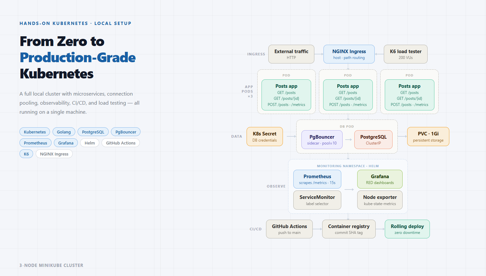

# Production-Grade Kubernetes Cluster — Local Setup

> A fully local, production-grade Kubernetes setup featuring a Go microservice, PostgreSQL with PgBouncer connection pooling, Prometheus & Grafana observability, NGINX Ingress, and a GitHub Actions CI/CD pipeline — all running on a 3-node Minikube cluster.

---

## Architecture



> **Traffic flow:** External traffic & K6 load tester → NGINX Ingress → Posts app pods (×3) → PgBouncer → PostgreSQL · Prometheus scrapes `/metrics` from each pod → Grafana dashboards · GitHub Actions builds and pushes on every merge to `main`.

---

## Tech Stack

| Layer | Technology |
|---|---|
| Cluster | Kubernetes · Minikube (3-node) |
| Application | Golang |
| Database | PostgreSQL |
| Connection Pooling | PgBouncer |
| Ingress | NGINX Ingress Controller |
| Observability | Prometheus · Grafana · kube-state-metrics |
| Package Management | Helm |
| Load Testing | K6 |
| CI/CD | GitHub Actions · Docker Hub |
| Secrets | Kubernetes Secrets |
| Storage | PersistentVolumeClaim (1Gi) |

---

## Project Structure

```
.
├── .github/
│   └── workflows/
│       └── ci.yml              # Build & push pipeline
├── cmd/
│   └── main.go                 # Application entrypoint
├── internal/
│   ├── db/                     # DB layer
│   ├── handlers/               # HTTP handlers
│   ├── metrics/                # custom app metrics
│   └── middleware/             # logging
├── k8s/
│   ├── db-secret.yaml
│   ├── ingress.yaml         
│   ├── db.yaml
│   ├── app.yaml                # Posts app deployment
│   └── prom-serviceMon.yaml
│    
├── load-tests/
│   └── k6-script.js            # K6 load test scenario
├── Dockerfile
├── .gitignore
└── README.md
```

---

## Prerequisites

- [Minikube](https://minikube.sigs.k8s.io/docs/) v1.30+
- [kubectl](https://kubernetes.io/docs/tasks/tools/) v1.30+
- [Helm](https://helm.sh/docs/intro/install/) v3+
- [Docker](https://docs.docker.com/get-docker/)
- [K6](https://k6.io/docs/get-started/installation/) (for load testing)

---

## Getting Started

### 1. Start the cluster

```bash
minikube start --nodes 3 --driver=docker --cpus=2 --memory=2200
minikube addons enable ingress
minikube addons enable metrics-server
```

### 2. Verify nodes are ready

```bash
kubectl get nodes
```

### 3. Create Kubernetes Secret

```bash
kubectl create secret generic postgres-secret \
  --from-literal=username=<your-db-user> \
  --from-literal=password=<your-db-password>
```

### 4. Apply manifests

```bash
kubectl apply -f k8s/
kubectl apply -f k8s/postgres/
```

### 5. Deploy monitoring stack via Helm

```bash
kubectl create namespace monitoring

helm repo add prometheus-community https://prometheus-community.github.io/helm-charts
helm repo update

helm install kube-prometheus-stack \
  prometheus-community/kube-prometheus-stack \
  --namespace monitoring \
  --set grafana.adminPassword=<your-password>

kubectl apply -f k8s/monitoring/
```

### 6. Configure local DNS

```bash
echo "$(minikube ip) posts.local" | sudo tee -a /etc/hosts
```

### 7. Verify everything is running

```bash
kubectl get pods
kubectl get pods -n monitoring
```

---

## API Endpoints

| Method | Endpoint | Description |
|---|---|---|
| `POST` | `/posts` | Create a new post |
| `GET` | `/posts` | List all posts |
| `GET` | `/posts/{id}` | Get a post by ID |
| `GET` | `/metrics` | Prometheus metrics scrape endpoint |

---

## CI/CD Pipeline

The GitHub Actions pipeline triggers on every push to `main`:

```
Push to main
    │
    ▼
Checkout code
    │
    ▼
Build Docker image (multi-stage)
    │
    ▼
Push to Docker Hub
  ├── Tag: <commit-sha>   ← immutable, fully traceable
  └── Tag: latest
```

The commit SHA is used as the primary image tag — every running pod can be traced back to the exact Git commit it was built from.

### Required GitHub Secrets

Navigate to **Settings → Secrets and variables → Actions** and add:

| Secret | Description |
|---|---|
| `DOCKERHUB_USERNAME` | Your Docker Hub username |
| `DOCKERHUB_TOKEN` | Docker Hub access token (not your password) |

> Generate a Docker Hub access token at: **Docker Hub → Account Settings → Security → New Access Token**

---

## Secrets Management

Kubernetes Secrets are **never committed to this repository**.

To apply secrets locally:

```bash
kubectl apply -f k8s/secret.yaml   # create this file locally, never push it
```

An example template is provided at `k8s/secret.example.yaml` with placeholder values.

---

## Load Testing

Run the K6 load test against the cluster:

```bash
k6 run load-tests/k6-script.js
```

The script ramps up virtual users in stages, sustains peak load, then ramps back down. Thresholds are defined for p95 latency and error rate. Monitor the results live in Grafana while the test runs.

---

## Observability

Access Grafana dashboards:

```bash
kubectl port-forward svc/kube-prometheus-stack-grafana 3000:80 -n monitoring
```

Open [http://localhost:3000](http://localhost:3000) — default credentials set during Helm install.

Dashboards include:
- Cluster node health (CPU, memory, disk)
- Pod-level resource usage
- Custom app metrics: request rate, error rate, p50/p95/p99 latency (RED method)
- PgBouncer connection pool utilisation

---

## Lessons Learned

- Always set explicit memory limits when starting Minikube nodes — the default is insufficient once monitoring is added
- Use commit SHA image tags, never `:latest` — Kubernetes caches images and won't re-pull an existing tag
- PgBouncer transaction pooling mode is incompatible with PostgreSQL prepared statements — disable them at the driver level
- Mismatched ServiceMonitor label selectors cause silent scrape failures — always verify in Prometheus's Targets UI
- Readiness probes must account for DB connection pool warm-up time — pods should not receive traffic until the pool is ready

---


<p align="center">Built with curiosity, debugged with patience.</p>
